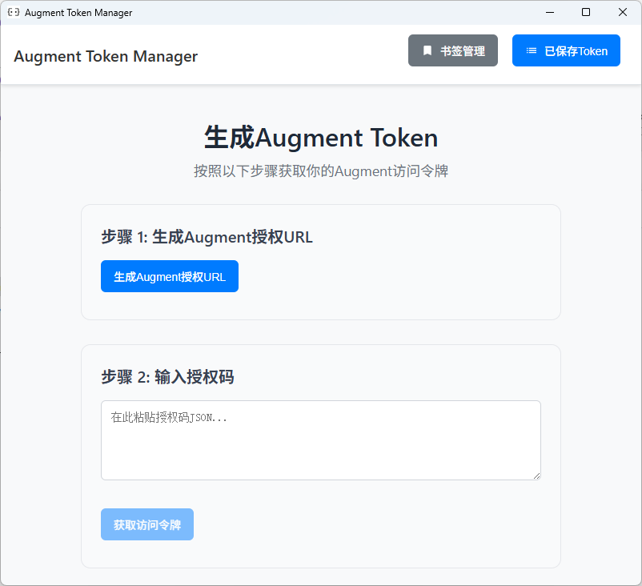
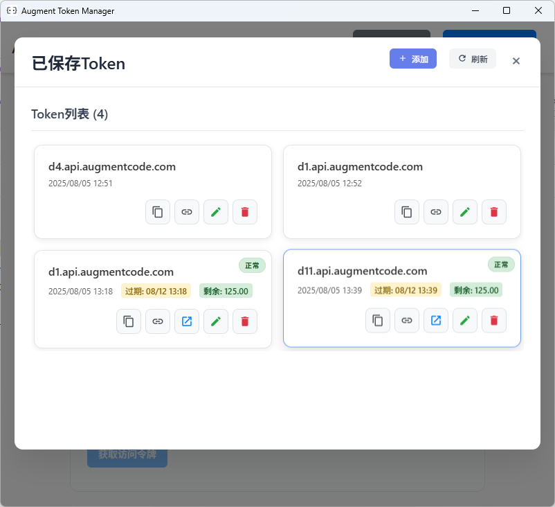

# Augment Token Manager

一个基于 Tauri 构建的跨平台桌面应用程序，用于生成和管理 Augment Code 访问令牌。

## 分支说明

### 🌟 Email_dev 分支（当前分支）
本分支在 main 分支基础上新增了邮箱管理功能和多项UI改进：

#### 新增功能：
- **📧 邮箱助手**：集成邮箱创建、管理和监控功能
- **🔄 邮箱删除逻辑优化**：确保云端删除成功后再删除本地记录
- **📤 Token导出功能**：支持导出Token到TXT文件
- **🎨 UI布局优化**：紧凑按钮布局，更好的空间利用

#### 主要改进：
- 修复邮件加载失败问题（safeLog未定义错误）
- 优化TokenList组件按钮布局和样式
- 改进删除邮箱的数据一致性逻辑
- 修复导出Token功能的响应式引用问题
- 增强移动端响应式布局

### 📦 main 分支
基础版本，包含核心的Token生成和管理功能。





## 安装指南

### 环境准备

1. **安装 Rust**：
   ```bash
   # Windows (PowerShell)
   Invoke-WebRequest -Uri https://win.rustup.rs/ -OutFile rustup-init.exe
   .\rustup-init.exe

   # macOS/Linux
   curl --proto '=https' --tlsv1.2 -sSf https://sh.rustup.rs | sh
   ```

2. **安装 Node.js**：
   - 从 [nodejs.org](https://nodejs.org/) 下载安装
   - 或使用包管理器（例如：`winget install OpenJS.NodeJS`）

3. **安装 Tauri CLI**：
   ```bash
   cargo install tauri-cli
   ```

### 快速构建（推荐）

#### Windows：
```powershell
cd augment-token-mng
.\build.ps1
```

#### macOS/Linux：
```bash
cd augment-token-mng
chmod +x build.sh
./build.sh
```

#### Docker
```bash
# Make build script executable
chmod +x docker/build.sh

# Build for Linux
./docker/build.sh linux

# Cross-platform build
./docker/build.sh cross

# Start development environment
./docker/build.sh dev
```

### 手动构建

#### 开发模式：
```bash
cd augment-token-mng
npm install          # 安装前端依赖
cargo tauri dev      # 启动开发服务器
```

#### 发布构建：
```bash
cd augment-token-mng
npm install          # 安装前端依赖
cargo tauri build    # 构建生产版本
```


## 使用方法

1. **生成授权 URL**
   - 点击"生成 Augment 授权 URL"按钮
   - 复制生成的 URL 或点击"打开授权 URL"在浏览器中打开

2. **浏览器授权**
   - 完成 OAuth 授权流程
   - 从浏览器复制 JSON 响应

3. **获取访问令牌**
   - 将 JSON 响应粘贴到文本区域
   - 点击"获取访问令牌"
   - 复制生成的访问令牌和租户 URL

4. **令牌管理**
   - 点击"保存 Token"保存当前令牌
   - 点击"查看Token"查看和管理所有保存的令牌
   - 支持编辑、删除和复制令牌
   - 支持导出Token到TXT文件

5. **邮箱助手**（Email_dev分支专有）
   - 点击"邮箱助手"打开邮箱管理界面
   - 支持邮箱创建、删除和监控
   - 自动获取验证码和邮件内容
   - 云端和本地数据同步管理

## 许可证

本项目是开源项目，采用 MIT 许可证。

## ⭐ Star History

[](https://star-history.com/#zhaochengcube/augment-token-mng&Date)
