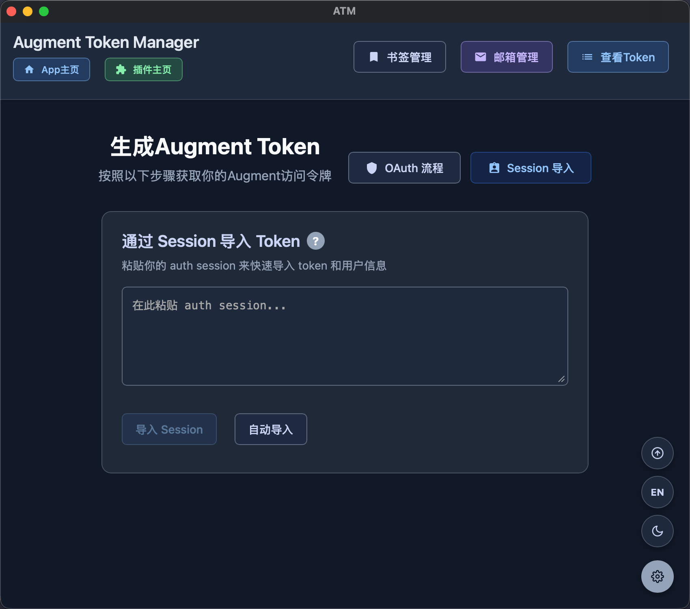

# Augment Token Manager

一个基于 Tauri 构建的跨平台桌面应用程序，用于生成和管理 Augment Code 访问令牌。




## 安装指南

### 包管理器安装（推荐）

#### MacOS - Homebrew
```bash
# 安装 Homebrew（如果尚未安装）
/bin/bash -c "$(curl -fsSL https://raw.githubusercontent.com/Homebrew/install/HEAD/install.sh)"

# 使用 Homebrew 安装依赖
brew tap zhaochengcube/atm
brew install --cask atm
# 更新
brew update
brew upgrade --cask atm
# 卸载
brew uninstall --cask atm
```

#### Windows - Scoop
```powershell
# 安装 Scoop（如果尚未安装）
Set-ExecutionPolicy RemoteSigned -Scope CurrentUser
irm get.scoop.sh | iex

# 使用 Scoop 安装依赖
scoop bucket add atm https://github.com/zhaochengcube/scoop-atm
scoop install atm
# 更新
scoop update atm
# 卸载
scoop uninstall atm
```

### Release 下载安装
在[Release](https://github.com/zhaochengcube/augment-token-mng/releases) 中根据平台选择对应的安装包进行安装即可

### 手动环境准备

1. **安装 Rust**：
   ```bash
   # Windows (PowerShell)
   Invoke-WebRequest -Uri https://win.rustup.rs/ -OutFile rustup-init.exe
   .\rustup-init.exe

   # macOS/Linux
   curl --proto '=https' --tlsv1.2 -sSf https://sh.rustup.rs | sh
   ```

2. **安装 Node.js**：
   - 从 [nodejs.org](https://nodejs.org/) 下载安装
   - 或使用包管理器（例如：`winget install OpenJS.NodeJS`）

3. **安装 Tauri CLI**：
   ```bash
   cargo install tauri-cli
   ```

### 快速构建

#### Windows：
```powershell
cd augment-token-mng
.\build.ps1
```

#### macOS/Linux：
```bash
cd augment-token-mng
chmod +x build.sh
./build.sh
```

#### Docker
```bash
# Make build script executable
chmod +x docker/build.sh

# Build for Linux
./docker/build.sh linux

# Cross-platform build
./docker/build.sh cross

# Start development environment
./docker/build.sh dev
```

### 手动构建

#### 开发模式：
```bash
cd augment-token-mng
npm install          # 安装前端依赖
cargo tauri dev      # 启动开发服务器
```

#### 发布构建：
```bash
cd augment-token-mng
npm install          # 安装前端依赖
cargo tauri build    # 构建生产版本
```


## 使用方法

1. **生成授权 URL**
   - 点击"生成 Augment 授权 URL"按钮
   - 复制生成的 URL 或点击"打开授权 URL"在浏览器中打开

2. **浏览器授权**
   - 完成 OAuth 授权流程
   - 从浏览器复制 JSON 响应

3. **获取访问令牌**
   - 将 JSON 响应粘贴到文本区域
   - 点击"获取访问令牌"
   - 复制生成的访问令牌和租户 URL

4. **令牌管理**
   - 点击"保存 Token"保存当前令牌
   - 点击"已保存 Token"查看和管理所有保存的令牌
   - 支持编辑、删除和复制令牌

5. **Session导入/自动导入**
   - Session导入按照主页中的帮助按钮提示操作
   - 自动导入，点击"自动导入"按钮，按照提示在浏览器中登录augment，登录后会在窗口右边显示导入Session的按钮，点击即可导入

6. **插件下载**
   - VSCode及其Fork使用[配套插件](https://github.com/zhaochengcube/augment-code-auto)
   - JetBrains系列产品使用[此插件](https://github.com/zhaochengcube/augment-token-mng/releases/download/v0.5.0/augment-token-mng-1.0.zip) 注意：JetBrains插件可能导致封号

## 许可证

本项目是开源项目，采用 MIT 许可证。

## ⭐ Star History

[](https://star-history.com/#zhaochengcube/augment-token-mng&Date)
